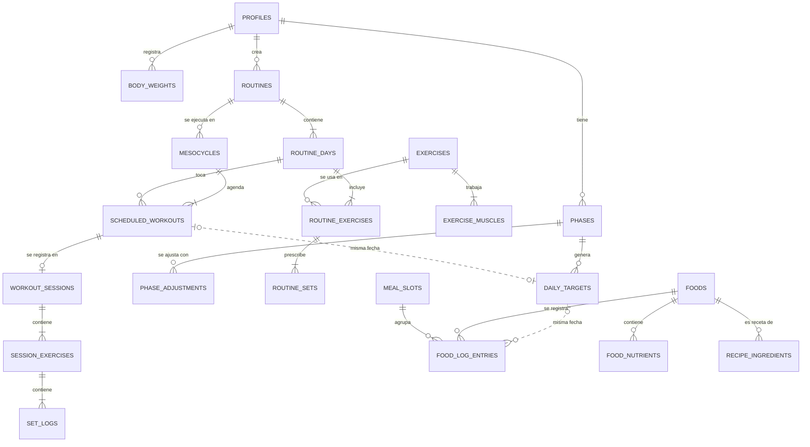

# Forus · Etapa 1 — Arquitectura y modelo de datos

> **Nombre:** Forus (antes "Forja", provisional).
> **Estado:** aprobada con ajustes el 30-09-2026. Uso personal (2 cuentas), sin cobro y estilo oscuro + naranjo. **Los cambios al alcance están en la sección 0 de `etapa-2-flujos-y-pantallas.md`, que prevalece sobre este documento.**
> **Fecha:** 30-09-2026

---

## 0. Resumen

1. **App web instalable (PWA), pensada primero para el celular**, hecha con React + TypeScript + Tailwind. Más adelante se empaqueta con **Capacitor** para App Store y Google Play reutilizando el mismo código.
2. **Supabase** (región São Paulo, la más cercana a Chile) como backend: login, base de datos Postgres con seguridad por fila (RLS), almacenamiento privado de fotos, funciones de servidor (Edge Functions) y tareas programadas (pg_cron).
3. **Todos los cálculos** (gasto energético, macros, progresión de cargas, 1RM, tendencia de peso, ciclado de carbohidratos) viven en un **núcleo TypeScript puro** que corre en el teléfono, así que funcionan sin señal y se pueden probar de forma automática.
4. **El diferencial vive en una tabla:** `daily_targets` guarda el objetivo nutricional **de cada fecha** y se calcula a partir de la **fase activa** y del **calendario de entrenamientos** (`scheduled_workouts`). Si mueves la pierna del martes al jueves, los carbohidratos se mueven con ella.
5. **49 tablas en 6 dominios; 34 entran al MVP.**
6. **El registro de la sesión funciona sin señal desde el MVP** (cola local + sincronización), no solo en premium.
7. **Datos de salud protegidos:** RLS en todas las tablas, fotos en bucket privado con enlaces temporales, consentimiento explícito (Ley 21.719).

---

## 1. Decisiones de arquitectura

### 1.1 Plataforma: PWA primero, tiendas después

| Criterio | PWA (React) + Capacitor después | Expo / React Native desde el inicio |
|---|---|---|
| Web responsive | Nativo | Posible, pero menos pulido |
| Publicar rápido sin pasar por tiendas | Sí (Netlify, como Cuentas Claras) | Requiere tiendas o una web aparte |
| Vibración del temporizador en iPhone | No (Safari no lo permite) → sonido + notificación | Sí |
| Apple Health / Health Connect | Solo con el envoltorio nativo (Capacitor) | Sí |
| Escáner de código de barras | Sí, con la cámara (ZXing) | Sí |
| Velocidad para iterar el MVP | Alta | Media |

**Decisión:** PWA primero. Validamos el producto con usuarios reales sin esperar revisiones de tiendas; cuando haga falta integrar salud y relojes, se agrega Capacitor sobre el mismo código.

**React + Vite en lugar de Next.js.** El pedido permite "React / Next.js". Lo que Next.js aporta (renderizado en servidor, rutas API) no sirve en una app que está detrás de un login, debe funcionar sin señal y luego se empaqueta con Capacitor (que exige una exportación estática, donde Next.js tiene fricciones con las rutas dinámicas). Con Vite el resultado es más simple. Si más adelante quieren una landing pública con SEO, puede ir aparte (incluso en Next.js).

### 1.2 Stack

| Capa | Elección | Por qué |
|---|---|---|
| UI | React 19 + TypeScript + Vite | Estándar, rápido, compatible con Capacitor |
| Estilos | Tailwind CSS + componentes shadcn/ui (Radix) | Accesibles, tema oscuro/claro por variables |
| Navegación | React Router | Barra inferior de 5 secciones, rutas simples |
| Datos del servidor | TanStack Query | Caché, reintentos y soporte sin conexión |
| Estado de la sesión en curso | Zustand + IndexedDB (Dexie) | Que ninguna serie se pierda si se cierra la app |
| Formularios | React Hook Form + Zod | Las mismas validaciones en cliente y servidor |
| Gráficos | Recharts | Peso, 1RM, volumen por músculo |
| Arrastrar y soltar | dnd-kit | Funciona con el dedo en el celular |
| Celebraciones | Motion + canvas-confetti | Récords personales y metas cumplidas |
| Sin conexión | vite-plugin-pwa (Workbox) | La app abre en el gimnasio sin señal |
| Código de barras | ZXing / BarcodeDetector nativo | Funciona en Android y iPhone |
| Informes PDF | @react-pdf/renderer (en el teléfono) | No requiere servidor |
| Pruebas | Vitest (núcleo) + Playwright (flujos clave) | Los cálculos de macros y cargas no pueden fallar |
| Backend | Supabase: Auth, Postgres + RLS, Storage, Edge Functions, pg_cron | Ya lo conoces; todo en un lugar |
| IA | Claude API, llamada solo desde Edge Functions | La clave nunca llega al teléfono |
| Pagos | Mercado Pago (web) + RevenueCat (tiendas) | Ver 1.6 |
| Hosting web | Netlify conectado a GitHub (compila en la nube) | Ver riesgo de npm en 4 |
| Nativo (después) | Capacitor | Health Connect, HealthKit, vibración, notificaciones |

### 1.3 Capas

```
┌──────────── Teléfono o navegador (PWA) ────────────┐
│  Interfaz (React + Tailwind)                       │
│  Núcleo de cálculo (TS puro, funciona offline)     │
│  Caché local IndexedDB + cola de sincronización    │
└───────────────┬────────────────────────────────────┘
                │ HTTPS + sesión (JWT)
┌───────────────▼──────── Supabase (São Paulo) ──────┐
│  Auth: correo, Google, Apple                       │
│  Postgres + RLS: cada usuario ve solo lo suyo      │
│  Storage privado: fotos de progreso                │
│  Edge Functions: IA, pagos, planes, ajuste semanal │
│  pg_cron: tareas de cada lunes                     │
└───────────────┬────────────────────────────────────┘
                │
┌───────────────▼──────── Servicios externos ────────┐
│  Claude API · Mercado Pago / RevenueCat            │
│  Open Food Facts · Health Connect / Apple Health   │
└────────────────────────────────────────────────────┘
```

### 1.4 Núcleo de cálculo (`src/core`)

Funciones puras, sin interfaz, con pruebas automáticas:

| Módulo | Qué calcula |
|---|---|
| `energia` | TMB (Mifflin-St Jeor), gasto total, superávit o déficit según el ritmo |
| `macros` | Proteína por fase, grasa mínima, carbohidratos y reparto por tipo de día |
| `tendencia` | Promedio móvil de 7 días del peso y ritmo real (kg/semana) |
| `ajusteSemanal` | Si conviene proponer ±kcal, cuánto y la explicación en lenguaje simple |
| `fuerza` | 1RM estimado (Epley/Brzycki), récords personales, series efectivas por músculo |
| `progresion` | Peso y repeticiones sugeridos para la próxima sesión (doble progresión + RIR) |
| `discos` | Qué discos poner por lado de la barra |
| `sustitucion` | Alimento equivalente y su cantidad para mantener los macros |

Así los cálculos funcionan sin señal, se prueban una sola vez y se reutilizan en las Edge Functions y en una futura app nativa.

### 1.5 Sin conexión y sincronización

- Cada serie se guarda **primero en el teléfono** (IndexedDB) y luego una cola la sube a Supabase.
- Los identificadores (UUID) se generan en el teléfono: si un envío se repite, no se duplica nada.
- Conflictos: gana la última escritura por registro (casi siempre es una persona con un solo dispositivo).
- Los borrados son lógicos (`deleted_at`) para que algo borrado sin señal no "reviva" al sincronizar.
- La app guarda en caché la interfaz, los ejercicios, tus rutinas y tus alimentos recientes y favoritos.
- **Decisión de producto:** el registro de sesión sin señal es para todos. Perder un entrenamiento por falta de señal en el subterráneo del gimnasio es la forma más rápida de perder un usuario. Premium ofrece el **offline completo** (base de alimentos descargada, diario y planificación sin conexión).

### 1.6 Pagos y control de acceso premium

- **Web:** Mercado Pago Suscripciones (cobro recurrente en CLP con tarjetas chilenas). Hasta donde sé, Stripe no abre cuentas a empresas constituidas en Chile; sirve si existe una empresa en un país soportado. Lo confirmo en la Etapa 5.
- **Tiendas:** Apple y Google exigen, por regla general, su propio sistema de cobro para suscripciones digitales dentro de la app. RevenueCat unifica web y tiendas en un mismo estado de suscripción.
- **La fuente de verdad es la tabla `subscriptions`**, que solo escriben los webhooks del servidor. La función SQL `is_premium()` se usa en RLS, triggers y Edge Functions. La interfaz solo muestra u oculta; la seguridad real está en el servidor.
- **Límites del plan gratis sin borrar datos:** se limita la creación (2 rutinas, controlado con un trigger) y la vista del historial (30 días). Al pasar a premium recuperas todo el historial, lo que además es un buen argumento de venta.

### 1.7 Inteligencia artificial

- `coach`: chat con Claude. El contexto se arma en el servidor con datos agregados (fase, objetivos, tendencia de peso, adherencia, volumen semanal). No se envían nombre, correo ni fotos.
- `foto-comida`: un modelo con visión propone alimentos y gramos; **el usuario confirma antes de guardar**.
- `informe-semanal`: se genera cada lunes con pg_cron.
- **Control de costos:** tabla `ai_usage` con un límite diario por usuario.

### 1.8 Contenido: el riesgo escondido

**Alimentos**
- **USDA FoodData Central** (dominio público): base de genéricos con micronutrientes completos; de ahí salen los ~80 nutrientes al estilo Cronometer. Hay que traducir nombres y porciones al español de Chile.
- **Preparaciones chilenas** (cazuela, porotos con riendas, pastel de choclo, empanada de pino, sopaipilla, completo…) se cargan como **recetas de ingredientes base**, así sus micronutrientes se calculan solos.
- **Tabla de composición de alimentos chilenos (INTA, U. de Chile):** ideal para validar, pero hay que pedir permiso de uso.
- **Productos de marca:** Open Food Facts por código de barras (licencia ODbL, exige atribución). Se consulta al escanear y se guarda en caché. Como la ley chilena de etiquetado obliga a informar la tabla nutricional por 100 g, crear un producto a mano es rápido.

**Ejercicios**
- Partir de un dataset abierto de dominio público (por ejemplo, free-exercise-db, ~800 ejercicios con fotos) traducido y curado hasta ~300. Hay que verificar la licencia al importar.
- **Animaciones/GIF:** licenciar una biblioteca comercial o encargarlas; tiene costo. El MVP usa imágenes estáticas.

### 1.9 Seguridad y privacidad

- **RLS en el 100 % de las tablas.** Todas las políticas usan una sola función, `can_access(user_id)`: hoy significa "soy yo"; mañana incluirá "soy tu entrenador con permiso vigente". El modo profesional no obliga a reescribir la seguridad.
- **Fotos:** bucket privado `progress-photos/{user_id}/…`, enlaces firmados de corta duración y eliminación de los metadatos EXIF (ubicación GPS) antes de subir.
- **Consentimiento explícito** para datos de salud en el onboarding (tabla `user_consents` con versión). La **Ley 21.719** de protección de datos (vigente desde el 1 de diciembre de 2026) trata los datos de salud como sensibles.
- **Exportar y eliminar la cuenta** desde Perfil.
- **Solo mayores de 18**, y advertencias si el objetivo implica menos de 1.500 kcal (hombres) o 1.200 kcal (mujeres), o bajar más del 1 % del peso por semana.
- **Sin SDKs de publicidad ni rastreadores** cerca de los datos de salud; la analítica de producto no usa datos sensibles.
- **Las claves secretas** (Supabase, Claude, pagos) solo viven en las Edge Functions.

---

## 2. Modelo de datos

### 2.1 Principios

1. **Claves UUID** que se pueden generar en el teléfono (necesario para funcionar sin señal).
2. **`user_id` en cada tabla del usuario + RLS** mediante `can_access(user_id)`.
3. **Catálogos mixtos en una sola tabla:** alimentos y ejercicios globales (`owner_id` nulo, solo lectura) conviven con los personales (`owner_id` = usuario, privados). Un solo buscador para ambos.
4. **Instantáneas históricas:** el diario guarda las calorías, macros y micros del momento; si después se corrige un alimento, tu historial no cambia.
5. **Fechas:** `date` en la zona horaria del usuario para responder "¿qué día fue?" (Chile cambia de horario dos veces al año); `timestamptz` para eventos.
6. **Unidades métricas internas** (kg, g, cm, ml); la conversión se hace en pantalla.
7. **Nombres de tablas en inglés** (convención técnica); todo lo que ve el usuario está en español.

Etapas: **M** = MVP (Etapa 3) · **I** = integración (Etapa 4) · **P** = premium (Etapa 5) · **F** = futuro.

### 2.2 Cuenta y perfil (4 tablas)

| Tabla | Para qué | Campos clave | Etapa |
|---|---|---|---|
| `profiles` | Una fila por usuario (id = `auth.users.id`) | sexo, fecha_nacimiento, estatura_cm, nivel_actividad, experiencia, objetivo, tipo_dieta, comidas_por_dia, presupuesto, dias_entreno[], duracion_sesion_min, hora_entreno, equipamiento[], zona_horaria, país, onboarding_completado_en | M |
| `user_consents` | Consentimientos con versión | tipo (salud, términos, marketing), versión, aceptado_en | M |
| `subscriptions` | Estado del plan | proveedor, plan, estado, fin_prueba, fin_periodo, ids externos | P |
| `coach_clients` | Modo profesional | coach_id, client_id, permisos, estado | F |

### 2.3 Fases y objetivos: el puente (3 tablas)

| Tabla | Para qué | Campos clave | Etapa |
|---|---|---|---|
| `phases` | Volumen, definición, mantención o recomposición | tipo, fecha_inicio, fecha_fin, ritmo_objetivo_kg_sem, peso_inicial, peso_objetivo, kcal_base, proteína_g_kg, grasa_pct, ciclado_activo, estado | M |
| `daily_targets` | **Objetivo nutricional de cada fecha** | fecha, phase_id, tipo_día (descanso / torso / pierna / deload), kcal, proteína_g, carbos_g, grasa_g, fibra_g, agua_ml, origen (fase / ciclado / manual / ajuste) | M (plano) → I (ciclado) |
| `phase_adjustments` | Propuestas del ajuste semanal | semana, tendencia_real, tendencia_esperada, delta_kcal, explicación, estado (propuesto / aceptado / rechazado) | I |

### 2.4 Entrenamiento (14 tablas, todas MVP)

| Tabla | Para qué | Campos clave |
|---|---|---|
| `muscles` | Catálogo (~20) | nombre, grupo, región (torso / pierna), tipo (empuje / tirón) |
| `exercises` | Biblioteca + personalizados | owner_id, nombre, patrón de movimiento, equipamiento[], mecánica (compuesto / aislamiento), tipo_carga (barra / mancuerna / máquina / polea / peso corporal), unilateral, instrucciones, errores_comunes, media_url, incremento_kg |
| `exercise_muscles` | Músculos por ejercicio | muscle_id, rol (principal / secundario), factor (1,0 / 0,5 para contar series efectivas) |
| `routines` | Rutina (p. ej. "PPL 6 días") | owner_id, nombre, división (full body, torso-pierna, PPL, weider, PHUL, PHAT, 5x5, propia), nivel, objetivo, es_plantilla, es_premium |
| `routine_days` | Días de la rutina ("Push A") | orden, nombre, demanda (baja / media / alta; se calcula y se puede corregir) |
| `routine_exercises` | Ejercicios del día | orden, grupo (A1/A2 para superseries), tipo_grupo (normal / superserie / biserie / triserie), descanso_seg, tempo, esquema_progresión, notas |
| `routine_sets` | Series prescritas | orden, tipo (calentamiento / efectiva / drop / rest-pause / back-off), reps_min, reps_max, peso_kg o %1RM, RIR o RPE objetivo |
| `mesocycles` | Una rutina ejecutada durante N semanas | routine_id, fecha_inicio, semanas, estado |
| `mesocycle_weeks` | Ajustes por semana | n_semana, es_deload, ajuste_rir, factor_volumen (p. ej. 0,5 en descarga) |
| `scheduled_workouts` | **Calendario: qué toca cada día** | fecha, routine_day_id, mesocycle_id, semana, estado (planificado / hecho / saltado / movido) |
| `workout_sessions` | Sesión real | scheduled_workout_id (opcional, permite sesiones libres), inicio, fin, peso_corporal, volumen_total, notas, estado |
| `session_exercises` | Ejercicios hechos | exercise_id, orden, sustituye_a, notas |
| `set_logs` | Cada serie | tipo, peso_kg, reps, RIR / RPE, fallida, 1rm_estimado (calculado), completada_en |
| `personal_records` | Récords | exercise_id, tipo (1RM est. / peso máx. / reps a un peso / volumen), valor, set_log_id, fecha |

### 2.5 Alimentación (18 tablas)

| Tabla | Para qué | Campos clave | Etapa |
|---|---|---|---|
| `nutrients` | Catálogo (~80) | código, nombre, unidad, categoría (vitamina / mineral / aminoácido / lípido…) | M |
| `nutrient_reference_values` | Recomendaciones por sexo y edad | nutrient_id, sexo, edad_min, edad_max, recomendado, límite_superior | P |
| `foods` | Genéricos, marcas, preparaciones y recetas | owner_id, nombre, marca, código_barras, tipo (genérico / marca / preparación / receta), grupo alimentario, fuente (usda / off / inta / usuario), verificado, kcal, proteína, carbos, grasa, fibra, azúcar, sodio (por 100 g), apto_vegano, apto_vegetariano, tags[] | M |
| `food_nutrients` | Micronutrientes por 100 g | food_id, nutrient_id, cantidad | M |
| `food_portions` | Medidas caseras | nombre (taza, cucharada, unidad, marraqueta…), gramos | M |
| `recipe_ingredients` | Ingredientes de preparaciones y recetas | receta_id → foods, ingrediente_id → foods, gramos | M |
| `food_prices` | Precio estimado | food_id, país, precio_por_kg, fuente, actualizado | P |
| `food_exclusions` | Lo que no te gusta o te cae mal | food_id o grupo, motivo (no me gusta / alergia / intolerancia) | M |
| `meal_slots` | Comidas del día configurables | nombre (desayuno, almuerzo, once, cena, colación), orden, hora_sugerida | M |
| `food_log_entries` | Diario | fecha, meal_slot_id, food_id, cantidad, porción, gramos, instantánea de kcal y macros, micros (jsonb), origen (manual / código / foto IA / plan / copia) | M |
| `saved_meals` | Comidas guardadas ("mi desayuno de siempre") | nombre | M |
| `saved_meal_items` | Ítems de la comida guardada | food_id, gramos | M |
| `food_favorites` | Acceso rápido | food_id | M |
| `water_logs` | Agua | fecha, ml | M |
| `meal_plans` | Plan semanal | semana, estado, generado_por, costo_estimado | M (ejemplo de 1 día) → I/P |
| `meal_plan_items` | Comidas del plan | fecha, meal_slot_id, food_id, gramos, registrado | M → I/P |
| `shopping_lists` | Lista de compras | meal_plan_id | I |
| `shopping_list_items` | Ítems de la lista | food_id, cantidad, marcado, costo_estimado | I |

Las recetas y preparaciones son `foods` con ingredientes: se registran igual que cualquier alimento y sus nutrientes se recalculan cuando cambian los ingredientes.

### 2.6 Progreso físico (4 tablas)

| Tabla | Para qué | Campos clave | Etapa |
|---|---|---|---|
| `body_weights` | Peso diario (uno por día) | fecha, peso_kg, grasa_pct (opcional) | M |
| `daily_summaries` | Resumen y racha | fecha, consumido vs objetivo, entrenó, día_cumplido | M |
| `body_measurements` | Medidas | fecha, zona (cintura, pecho, brazo, muslo, cadera…), cm | I |
| `progress_photos` | Fotos privadas | fecha, pose (frente / perfil / espalda), ruta_storage | I |

### 2.7 IA e integraciones (6 tablas)

| Tabla | Para qué | Etapa |
|---|---|---|
| `ai_conversations` / `ai_messages` | Chat con el coach | P |
| `weekly_reports` | Informe semanal | P |
| `ai_usage` | Control de costo por usuario | P |
| `device_connections` | Apple Health / Health Connect | F |
| `daily_activity` | Pasos, kcal activas, frecuencia cardíaca | F |

**Totales:** 49 tablas · 34 MVP · 5 integración · 7 premium · 3 futuro.

### 2.8 Relaciones principales



Las líneas punteadas no son claves foráneas: se unen por usuario + fecha. Así un día sin entrenamiento o sin comidas registradas sigue teniendo su objetivo.

### 2.9 Cómo se conectan entrenar y comer

1. Al activar un mesociclo se crean los `scheduled_workouts` de cada fecha.
2. Para cada fecha el núcleo define el **tipo de día**: descanso, torso (demanda media), pierna (demanda alta) o descarga.
3. Fase activa + tipo de día → `daily_targets` de esa fecha:
   - la proteína se mantiene constante;
   - la grasa casi constante;
   - **los carbohidratos absorben la diferencia**: suben en pierna y bajan en descanso;
   - **el promedio semanal de calorías respeta el objetivo de la fase.**
   Ejemplo con 2.500 kcal de promedio y 4 entrenamientos: pierna 2.800 · torso 2.600 · descanso 2.230.
4. Si mueves un entrenamiento, se recalculan ambas fechas. El inicio lo explica: "Hoy toca pierna: tienes +70 g de carbohidratos".
5. Cada lunes (pg_cron) se compara la tendencia de peso con el ritmo esperado. Si pasan 2 semanas fuera de rango **y hubo buena adherencia**, se crea un `phase_adjustments` con la propuesta y su explicación. Al aceptarla se actualizan los objetivos futuros.

### 2.10 Reglas de negocio que el modelo ya contempla

- **TMB (Mifflin-St Jeor):** hombres 10·peso + 6,25·estatura − 5·edad + 5; mujeres igual, pero − 161. Factor de actividad de 1,2 a 1,9.
- **Punto de partida del superávit o déficit:** ≈ 7.700 kcal por kg → +0,25 kg/sem ≈ +275 kcal/día; −0,5 kg/sem ≈ −550 kcal/día. El ajuste semanal lo corrige con datos reales.
- **Proteína:** 1,6–2,0 g/kg en volumen y mantención; 2,0–2,2 g/kg en definición. Con % de grasa alto se calcula sobre el peso objetivo para no inflar la cifra.
- **Grasa:** ~25 % de las kcal (mínimo 0,6 g/kg). **Carbohidratos:** el resto.
- **1RM estimado:** Epley, peso × (1 + reps/30), solo con series de hasta 12 repeticiones.
- **Series efectivas:** solo series efectivas (sin calentamiento) con RIR ≤ 4; el músculo secundario suma 0,5. Referencia para hipertrofia: 10–20 series por músculo a la semana.
- **Ajuste semanal responsable:** no se ajustan las calorías si hubo menos de 4 pesajes o menos de 5 días con comida registrada en la semana; primero se pide constancia.

---

## 3. Estructura del proyecto

```
forja/
├─ docs/                ← propuestas de cada etapa
├─ src/
│  ├─ core/             ← cálculos puros con pruebas
│  ├─ features/         ← onboarding, entrenar, comer, progreso, perfil
│  ├─ components/ui/    ← botones, tarjetas, barras (tema oscuro/claro)
│  ├─ lib/              ← supabase, offline (Dexie), textos en español
│  └─ app/              ← rutas y barra de navegación inferior
├─ supabase/
│  ├─ migrations/       ← SQL versionado: tablas, RLS, funciones
│  ├─ functions/        ← Edge Functions: IA, pagos, planes, ajuste semanal
│  └─ seed/             ← alimentos, ejercicios, plantillas de rutinas
└─ public/              ← íconos y manifest de la PWA
```

---

## 4. Supuestos

1. **Mercado inicial: Chile** (CLP, español de Chile, zona America/Santiago); el resto de LatAm después.
2. **Nombre provisional:** Forja.
3. **React + Vite** en vez de Next.js (ver 1.1).
4. **Cuenta individual.** El modo profesional queda diseñado (`can_access`, `coach_clients`), pero se construye después.
5. **Solo unidades métricas** en el MVP.
6. **MVP sin cobro:** todo abierto; los límites gratis/premium se activan en la Etapa 5 (el modelo ya los soporta).
7. **Contenido del MVP:** ~300 ejercicios con imagen estática, ~1.000 alimentos genéricos y ~100 preparaciones chilenas.
8. **El registro de sesión sin señal es para todos.**
9. **Cuentas y claves las creas tú** (Supabase, Netlify, GitHub, Apple Developer), como en Cuentas Claras; yo nunca manejo claves secretas.
10. **npm en este equipo:** hoy responde, pero muy lento (más de 5 minutos para una sola consulta), así que instalar un proyecto React completo sería inviable. Para la Etapa 3 hay dos caminos: compilar en la nube (GitHub → Netlify) o revisar la red/proxy del equipo.

## 5. Riesgos y costos a tener presentes

| Riesgo | Mitigación |
|---|---|
| Base de alimentos chilena y animaciones: licencias y costo | USDA + recetas propias; pedir permiso al INTA; imágenes estáticas en el MVP |
| iPhone vía web: sin vibración; notificaciones solo si se instala la PWA | Sonido + pantalla siempre encendida (Wake Lock); Capacitor más adelante |
| Google retiró las APIs de Google Fit | Usar Health Connect (requiere app Android nativa) |
| Cobro dentro de las tiendas | RevenueCat; en la web, Mercado Pago |
| Costo de IA descontrolado | `ai_usage` con límites; IA solo en premium |
| Datos de salud (Ley 21.719) | Consentimiento, RLS, exportar y borrar la cuenta, fotos privadas |

**Costos fijos aproximados al lanzar:** Supabase Pro (~USD 25/mes; el plan gratis pausa el proyecto tras una semana sin uso), Apple Developer (USD 99/año, necesario incluso para "Iniciar sesión con Apple" en la web), Google Play (USD 25, pago único, cuando se publique en la tienda), dominio propio y el consumo de la IA.
